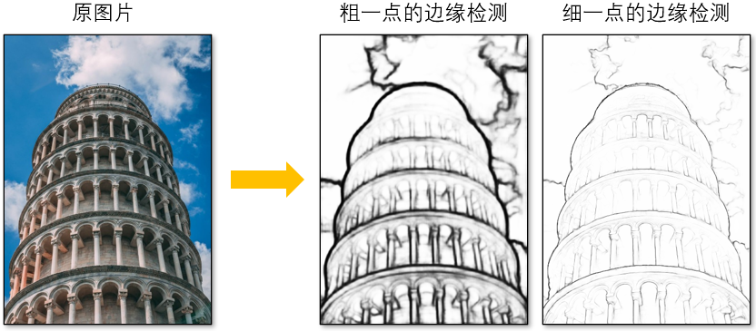
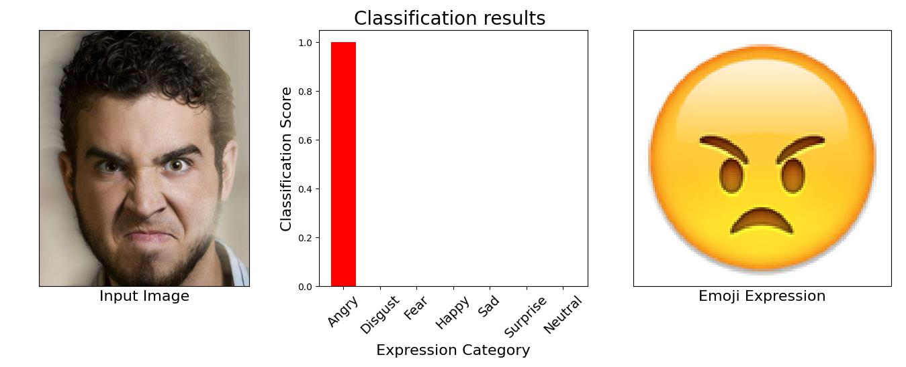
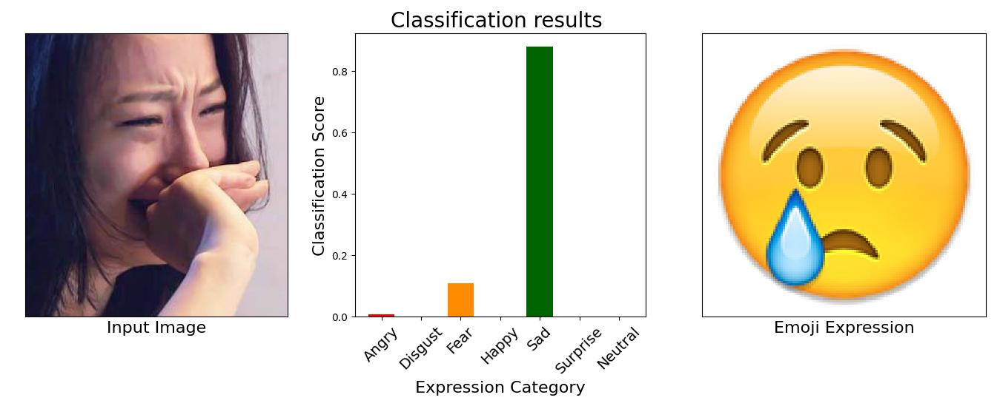
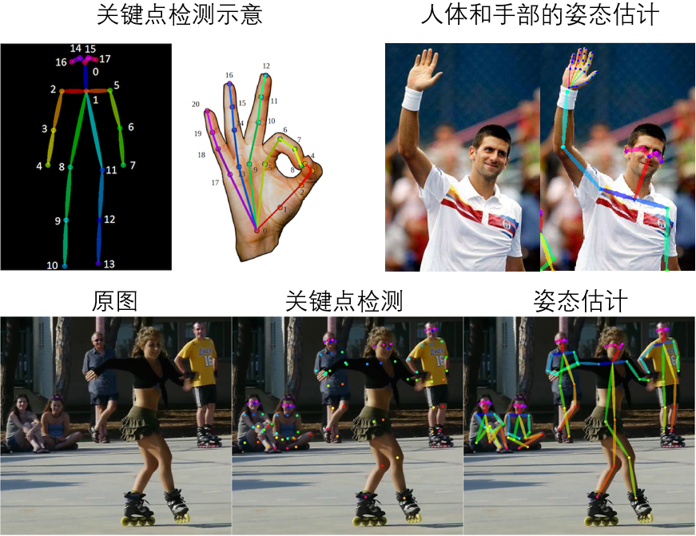
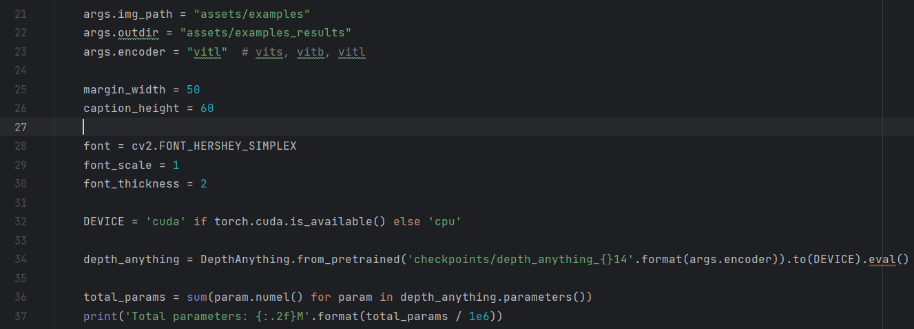
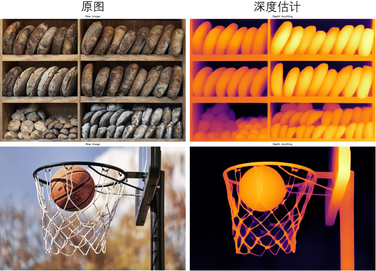
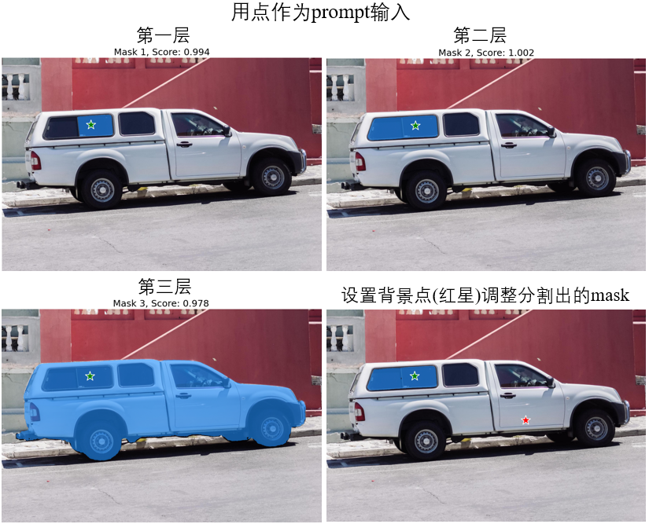
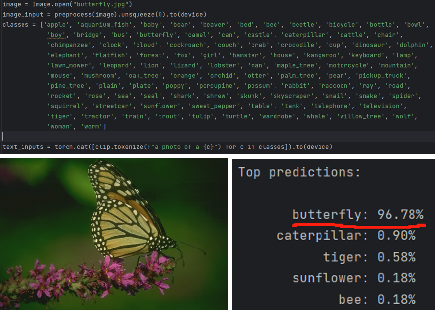
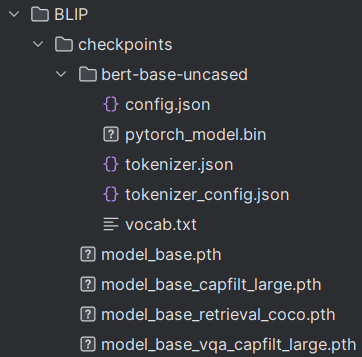
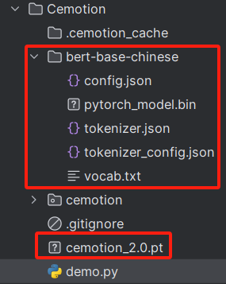

# 感知 (Perception)

利用AI算法去做感知的共性是从图片（也可以是视频、红外、雷达等）等信息载体中分析信息（可以是分类、检测、分割，甚至光照、材质），但较为通用的，一般都是基于图像感知信息。

目前，本文档主要包括图像的分类、分割、深度估计、边缘检测，人脸检测与分类，人体姿态估计等任务。

## 边缘检测 (Edge detection)
### 代码参考：
此处选择PiDiNet是由于其模型非常轻量，推理速度极快。但是基于深度学习的边缘检测网络大多都有检测结果比较粗厚的问题，所以使用Delving-into-Crispness的方法细化。

PiDiNet: [[Paper](https://openaccess.thecvf.com/content/ICCV2021/papers/Su_Pixel_Difference_Networks_for_Efficient_Edge_Detection_ICCV_2021_paper.pdf)], [[Code](https://github.com/hellozhuo/pidinet)]

Delving-into-Crispness: [[Paper](https://arxiv.org/abs/2306.15172)], [[Code](https://github.com/yunfan1202/Delving-into-Crispness)]

### 使用：
进入Edge_detection/pidinet文件夹，BSDS_raw.pth和BSDS_refine_dice.pth两个模型已经到位了的话，pycharm直接运行```demo.py```即可，或者在命令行```python demo.py```

仅使用的话可以只关注以下行，注释和变量名字也写得比较清楚了，把要检测的图片放在args.datadir下面，用args.evaluate指定模型路径，用args.savedir指定边缘检测结果的保存路径。


另外，此处用multiscale_test是将图片缩放到0.5, 1, 1.5倍做边缘检测然后再resize回来取平均得到的结果，能获得更多的细节，当然也会导致略长的时间和显存开销，可以试试。




## 人脸检测与识别 (Face detection and recognition)
### 代码参考：

[OpenCV的人脸检测模型](https://blog.csdn.net/LOVEmy134611/article/details/121006385)

[Facial-Expression-Recognition.Pytorch](https://github.com/WuJie1010/Facial-Expression-Recognition.Pytorch)

### 使用：
首先是**人脸检测**，进入到Face/face_detection，直接运行```demo_face_detection.py```即可，图中这里两个函数，一个是opencv里的Haar级联检测器，一种是dnn网络的检测，一般来说dnn的表现要好一些


然后可以将上面检测到的人脸从图片中切下来，进行后续的情绪识别。进入到Face/face_recognition，模型[PrivateTest_model.t7](https://github.com/yunfan1202/intellegent_design/releases/download/checkpoints/PrivateTest_model.t7)下好后放到checkpoints目录下，直接运行```visualize.py```即可，





## 人体姿态估计 (Human pose estimation)
### 代码参考：
原[openpose](https://github.com/CMU-Perceptual-Computing-Lab/openpose)需要配置C++环境，有兴趣有条件的可以去玩玩，这里还是找了个pytorch版本的[pytorch-openpose](https://github.com/Hzzone/pytorch-openpose)

### 使用：
进入Pose_estimation/pytorch-openpose，把[body_pose_model.pth](https://github.com/yunfan1202/intellegent_design/releases/download/checkpoints/body_pose_model.pth)和[hand_pose_model.pth](https://github.com/yunfan1202/intellegent_design/releases/download/checkpoints/hand_pose_model.pth)下载好后放入model目录，直接运行```demo.py```即可，```demo_camera.py```会实时检测自己电脑摄像头里的人体姿态，```demo_video.py```则是对所有视频帧进行姿态估计




## 深度估计 (Depth-Anything)
### 代码参考：

[Depth-Anything](https://github.com/LiheYoung/Depth-Anything)

### 使用：
进入Depth-Anything文件夹，把[depth_anything_vitb14](https://github.com/yunfan1202/intellegent_design/releases/download/checkpoints/depth_anything_vitb14.zip)或者[depth_anything_vitl14](https://github.com/yunfan1202/intellegent_design/releases/download/checkpoints/depth_anything_vitl14.zip)或者[depth_anything_vits14](https://github.com/yunfan1202/intellegent_design/releases/download/checkpoints/depth_anything_vits14.zip)相关文件下载好放入checkpoints（主要包含了config.json和pytorch_model.bin）。


直接运行```run.py```即可，将会把assets/examples下的图片都深度估计后放到assets/examples_results下




同理，运行```run_video.py```可以推理assets/examples_video下的视频。


## 图像分割 (Segmentation)
### 代码参考：

[segment-anything](https://github.com/facebookresearch/segment-anything)

进入segment-anything文件夹，把[sam_vit_b_01ec64.pth](https://dl.fbaipublicfiles.com/segment_anything/sam_vit_b_01ec64.pth)或者[sam_vit_h_4b8939.pth](https://dl.fbaipublicfiles.com/segment_anything/sam_vit_h_4b8939.pth)或者[sam_vit_l_0b3195.pth](https://dl.fbaipublicfiles.com/segment_anything/sam_vit_l_0b3195.pth)模型下载好放入checkpoints。

除了其他需要的包，还需要先
在segment-anything文件夹下```pip install -e```（参考[这里](./segment-anything/README.md)）

直接运行notebooks里面的```automatic_mask_generator_example.py```和```predictor_example.py```即可（基本都是从对应的.ipynb简单整理而来，您也可以装了jupyter notebook直接玩.ipynb文件）

<details>
<summary>如果出现以下报错</summary>
“NotImplementedError: Could not run ‘torchvision::nms’ with arguments from the ‘CUDA’ backend. This could be because the operator doesn’t exist for this backend”

去网上搜可能大多数都是说torch和torchvision版本不对，但也有可能是没有安装torchvision的cuda版本，因为pytorch官网的安装命令，没有自动安装torchvision with CUDA: https://github.com/ultralytics/ultralytics/issues/1774


输入pip list，看到torch这块，后面没有 +cu121


因此，输入```pip install torchvision==0.16.2+cu121 –f https://download.pytorch.org/whl/torch_stable.html``` 安装好之后再查


就可以了
</details>


```automatic_mask_generator_example.py```是自动对原图直接进行推理


```predictor_example.py```则展示了用点或者是用框作为prompt条件分割的结果。

用一个点作为prompt时（图中的绿色星星），如果这是一个更大物体内部的要素（比如这个车里的车窗），那么输出会有最多三个层次，比如这里的小车窗，大车窗和整个车的mask，同样，也可以设置额外的背景点（图中的红色星星），得以指定输出车窗的mask



而用框作为prompt时，模型会检测框内目标的mask，同样可以结合额外背景点（红星星）来调整最终的mask，也可以设置多个框输出多个mask


## 零样本图像分类 (Zero-shot image classification)
本来图像分类应该预设好类别，用诸如ResNet，efficientNet等网络训练推理的，但是现在已经往Open Vocabulary([综述](https://zhuanlan.zhihu.com/p/642557849))发展很久了，所以干脆直接一步到位用类似CLIP这样的特征去做文本和图片的相似度对比以达成分类的效果，可能还更简单效果更好，自由度也高。

### 代码参考：

[CLIP](https://github.com/openai/CLIP)

### 使用：
进入CLIP文件夹，把[ViT-B-32.pt](https://github.com/yunfan1202/intellegent_design/releases/download/checkpoints/ViT-B-32.pt)模型下好放入checkpoints文件夹里面，直接运行```demo.py```即可。CLIP用了大量的图像文本对训练，因此能一定程度上通过相似度对比来对齐找到符合文本描述的图片。此处"a diagram", "a dog", "a cat"中，"a diagram"是与这张图片相似度最高的(>0.99)


那么，我们便可以通过提取诸如“a photo of a 类别”这样的文本的特征，去跟图片的特征做余弦相似度的对比，相似度最(比较)高的即可认为此图片就是这个“类别”。

比如这里用了一张蝴蝶的图片，然后用这么一大堆咱们预设的类（您也可以预设自己希望分类的类别，就改这一段代码就行）去计算特征相似度，然后butterfly的相似度高达"96.78%"，那基本就是这个了。



如果您想做的东西比较重视中文语境的图片理解（比如要正确认识"驴打滚"，"佛跳墙"，而不是真的"驴"去打滚和"佛"去跳墙），那么也可以考虑玩玩[Chinese-CLIP](https://github.com/OFA-Sys/Chinese-CLIP)


## 图像描述、问答等 
### 代码参考：
[BLIP](https://github.com/salesforce/BLIP)
是一个兼顾图文理解和生成的多模态模型，可以用来做图像描述(Image Captioning)，问答(Visual Question Answering)等，同时也能做到CLIP的提特征，零样本分类（但是具体用哪一种特征更合适，还是得看实际需求，自己试了才知道）

### 使用：
进入BLIP文件夹，下好[bert模型(bert-base-uncased文件夹，pytorch版本)](https://github.com/yunfan1202/intellegent_design/releases/download/checkpoints/bert-base-uncased.zip)、[model_base.pth](https://storage.googleapis.com/sfr-vision-language-research/BLIP/models/model_base.pth)、[model_base_capfilt_large.pth](https://storage.googleapis.com/sfr-vision-language-research/BLIP/models/model_base_caption_capfilt_large.pth)、[model_base_retrieval_coco.pth](https://storage.googleapis.com/sfr-vision-language-research/BLIP/models/model_base_retrieval_coco.pth)、[model_base_vqa_capfilt_large.pth](https://storage.googleapis.com/sfr-vision-language-research/BLIP/models/model_base_vqa_capfilt_large.pth)等预训练模型（按需下载），都放入checkpoints文件夹。如果需要不同版本大小的模型，原本的[BLIP Pre-trained checkpoints](https://github.com/salesforce/BLIP?tab=readme-ov-file#pre-trained-checkpoints)上也都有。



然后直接运行demo.py即可（安装了jupyter notebook的话也可以直接用他原本的demo.ipynb玩）


## 语音识别 

### 代码参考：
语音是一种常见的交互模态，而[whisper](https://github.com/openai/whisper)
是一个端到端的语音系统框架，以英语为主，支持包括中文在内的多种语言，以语音识别任务为主，但也支持语音翻译的能力，提供了多种规格的模型以适应不同场景

### 使用：
首先安装好[ffmpeg](https://blog.csdn.net/qq_57171795/article/details/122842989),进入whisper文件夹，直接运行```demo.py```。会自动下载诸如```base.pt```这样的模型，自动下好的模型路径会放在“C:\Users\你的用户名\.cache\whisper”下

我直接用Window搜索“录音机”，用系统自带的录音机录了一段```examples/test.mp3```，结果如下


## 文本（情绪）分类

### 代码参考：
[Cemotion](https://github.com/Cyberbolt/Cemotion)是可以进行中文情感倾向分析的基于BERT (Bidirectional Encoder Representations from Transformers)的方法，会为中文文本返回0～1之间的情感倾向置信度(0为消极，1为积极)。

### 使用：
进入Cemotion文件夹，下载[bert-base-chinese](https://github.com/yunfan1202/intelligent_design/releases/download/checkpoints/bert-base-chinese.zip)模型文件夹和[cemotion_2.0.pt](https://github.com/yunfan1202/intelligent_design/releases/download/checkpoints/cemotion_2.0.pt)模型，放入Cemotion文件夹路径下，如下图所示结构


再运行```demo.py```，不出意外的话可以看到如下结果


## 语音（情绪）分类
准确理解用户的语音指令和意图是构建高效人机交互系统的基础。一个高品质的语音交互系统不仅需要理解字面上的语言内容，更应捕捉到说话者语音中蕴含的情感信息。
语音相比文本，所能表达的情绪特征是更为丰富的，不管是声调，语气，还是语速，都能一定程度上额外体现人的情感。因此，除了用语音识别转文本，文本再进行情绪分类以外，还需要直接端到端输入语音，输出感知情绪的方法。
### 代码参考：
[emotion2vec](https://github.com/ddlBoJack/emotion2vec)利用自监督学习方法，在大量无标记的公开情感数据上进行预训练，成功地学习到了高度通用的语音情感特征，表现优秀。

### 使用：
进入emotion2vec文件夹，将[emotion2vec_base_finetuned](https://github.com/yunfan1202/intelligent_design/releases/download/checkpoints/emotion2vec_base_finetuned.zip)模型文件夹下载好放入checkpoints路径下，如下图所示结构


再运行```demo.py```（这个需要安装modelscope和funasr等相关依赖的包），同样，测试的还是我自己录的```test.mp3```，不出意外的话可以看到如下结果（可能会有一些warning，但问题不大）


